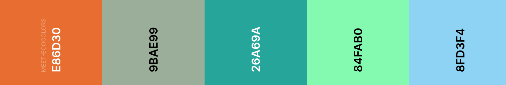

# **MeetEco**

MeetEco is an easy event creator based on ecological concerns.

## **User Experience**

 The navigation bar is at the head of the page easily visible. 
 The "Home" button and the logo will take you right back to the landing with hero image and website motto.   
 "How it works" tab will take you to short explanation about how to use the website.
 "See the events" tab will take you to the events created.    
 "Create an event" will take you to a form in order to create the event
 In the footer you can find the email to contact me and navigation link to the pages, also a link to send the user to top of the page.

#### **User Stories**

As a user I would like  
* to have clear understanding what is the purpose of the website.
* to see how can I use the website.  
* to be able to create an event
* to be able to edit or delete the event when I need to.
* to see the created events and if I am interested, to be able to attend.
* to be able to contact someone when I need to.

As a owner I would like
* to make sure users will understand how to interact with the website.
* to make sure the user create ecological concern based events.
* to make sure only the creator is able to change or delete the event.
* to ensure the user can contact me if they see any fault or suggestion to improve the website.

### **Strategy**

I wanted to answer users common questions such as "Is this what I expected to see?", "Does it offer what I want?",
"Is it valuable enough for me to return?". 
For this website I aimed to create an user friendly, intiuitive structure. To do that I tried to create a simple but visually appealing website

### **Scope**

This website scope are those people who would like to create events based on ecological concerns, therefore I limited the event categories.   

### **Structure**

The website is built in home, create and edit sections:  
Home page has 4 sections:  
"Landing" has hero image and website motto sharing the screen large and medium sizes. 
"How it works" gives the short details about how to use the website.
"See the events" displays all the events to the website visitors anyone can see the any events happening with details in materialized card and can show their interest by providing their details.  
Also the creator can edit their events with the id provided when they created the event. This will take the user to edit page.
"Footer" is a responsive footer, pinned to the bottom of the page, with Contact Details, links to the navigation for the website.

"Create an Event" page allow user to create event. I kept the events limited so user will only create climate concern based events. As the user  
create an event there will be an modal screen that informs the user about the event id and that they can change or delete it with this unique code.

### **Skeleton**

I tried to give as many information as I can with minimal choices. Navigation has "home", "how it works" and "see the events" and "create an event" sections.  
The website prototype I have designed is [here](wireframe/MeetEco.pdf).  
### **Surface**

The colors I used in this project were:  

  

I used Google fonts for the website; font *"Monoton"* for the website motto , font *"Oswald"* for the headings and, *"Lato"* for the paragraphs and contents. 

## **Features**
### **Existing Features**

User can
*  navigate through the site with Navbar, they can go to how it works and see the event section.
*  get more information about the events on the events section.
*  create an event based on solutions to world's ecological problems.
*  see the event id as soon as they created.
*  show interest by providing user details.
*  creator can update or delete the event once they provided the given id number.

### **Features Left to Implement**
* At the moment in order to edit or delete the event, user has to provide the unique event id 
  this is not secure or user friendly option so in the future I would like to set login page  
  for user to register and login to Create an user account to control event creation, edit and delete options.  
* I would like to add a filter option for the events based on location so user can see nearby events.
* Make user able to add more event categories to widen the event options.
* Make user able to add pictures they choose.

## **Technologies Used**

  * HTML

  * CSS

  * Javascript 

  * JQuery  Used for some of the main javascript functionality.

 

  * [Bootstrap](https://getbootstrap.com/)

  * [Google Fonts](https://fonts.google.com/) *Lato*, *Oswald*, *Monoton*

  
  * [Fontawsome](https://fontawesome.com/) for the event categories icon.

  * [Materializecss](https://materializecss.com/) for the designing the card and footer.

  
### **Back-End Technologies**
* Flask - Used as the microframework.
* Jinja - template to simplify displaying data from the backend of this project smoothly and effectively in html.
* Heroku - Used to host the application
* Python - The back-end programming language.
* Pymongo - Used to connect the python with the database.
* MongoDB Atlas - Used to store the database.
* PIP - for installation of tools needed in this project.

### **Database Schema**
The application uses MongoDB for data storage. MongoDB was chosen as the database to use due to the unstructured format of the data that will be stored within it.  
The data stored in the database are the following:

* Object  
* String  
* Array  
### **Data structure**  

#### Event_categories  
| Title         | 	Key in db	    |  Data type |  
| ------------- |:-----------------:|-----------:|
| event_id      |      _id          |ObjectId    | 
| event_name    | Event name        |String      | 
| event_picture | path to the image |String      |

#### Events

| Title             | Key in bd         | Data     |
| -------------     |:-----------------:| --------:|
| event_id          | _id               | ObjectId |
| organiser_name    | Name              |   String |
| event_description | Event description |   String |
| event_date        | Event date        | String   |
| guests            | attenders details | Array    |
## **Testing**
To test the website I have used Google developer tools during and after creating the site to check CSS elements and website responsiveness,  
"console" and "source" for js function and typing errors.

I tested the responsivenes between different mobile devices using Google developer tools. I also tested it in most common browsers such as Chrome, Mozilla,  
Safari, Opera.  
I tested my html code with [W3C HTML Validator](https://validator.w3.org/).  
* There were minor errors such as image alt tag which I fixed accordingly.  
* There is also id duplication error exist at the moment due to way of creation of the modals.

I tested my CSS code with [W3C CSS Validator](https://jigsaw.w3.org/css-validator/).I fixed the errors and warnings accordingly.

I tested my Javascript code with [JSHint](https://jshint.com/) there was typing error such as missing semicolon and undefined variables, these were also fixed accordingly.
I tested Python code with PEP8 using it as follow:

The autopep8 extension was installed in the workspace.

To install this enter this in the terminal:
`pip3 install --upgrade autopep8`
In order for autopep8 to run, pycodestyle is also required. To instlal pycodestyle, enter this command into the terminal:

`pip3 install pycodestyle`
Once these steps are complete, you can format the code into PEP8 formatting by entering this command into the terminal:

`autopep8 --in-place --aggressive --aggressive app.py`

I have recieved no error in the end of testing

## Bugs
I had problems mainly due to modals:  
The way of the modal's creations are loop for instance Join the Event button every modal I created had the same id `id="attender"` so the buttons were defaulting to the first one. Therefore, code was only working for
the first modal not the rest.  
I have fixed it with appending unique event id numbers to the element id's using jinja templates. `id="attender{{event._id}}"`

The other problem I was having, id validation:  
When the user input and event id matches the button would take the user to the edit page however if it doesn't match it stays on the page 
without giving any error. When I tried to populate the error using javascript on the modal screen I was again having the id name problem 
again therefore I had to carry the JS code to index page and it fixed my problem. I am aware that this is not the best solution however is 
the best of my knowledge, in the future I am planning to use ajax js code to fix this.  

Card buttons were collating on top of each other on the xs and small sized devices I fixed the issue by taking the Materialize icons from card buttons  
when the screen small.

## **Deployment**
#### To run this project locally

In order to run this project locally, you will need to install the following:

An IDE, such as VS Code
PIP to install the app requirements.
Python3 to run the application
GIT for version control
MongoDB to develop the database.
Once this is done, you will need need to download the .ZIP file of the repository, unzip this file and then in the CLI with GIT installed, enter the following command:

`https://github.com/ozluna/meet-eco.git` 
Navigate to the to path using the cd command.

Create a .env file with your credentials. Be sure to include your MONGO_URI and SECRET_KEY values.

Install all requirements from the requirements.txt file using the following command:

  `sudo -H pip3 -r requirements.txt`

You should then be able to launch your app using the following command in your terminal:

  `python app.py`

## Remote Deployment
* Create a `requirements.txt` file using the terminal command  `pip3 freeze --local > requirements.txt` .
* Create a Procfile with the terminal command `echo web: python app.py > Procfile`.
* `git add` and `git commit` the new requirements and Procfile and then `git push` the project to GitHub.
* Head over to Heroku
* Click the "new" button, give the project a name & set the region to Europe.
* From the heroku dashboard of your newly created application, click on `"Deploy" > "Deployment method"` and select GitHub.
* Confirm the linking of the heroku app to the correct GitHub repository.
* In the heroku dashboard for the application, click on "Settings" > "Reveal Config Vars".
* Set the following config vars:

| KEY           | VALUE                              | 
| ------------- |:----------------------------------:|
| IP            | 0.0.0.0                            | 
| PORT          | 5000                               |  
| MONGODBNAME   | <database_name>                    | 
| MONGO_URI     |mongodb+srv://:@<cluster_name> -qtxun.mongodb.net/<database_name> ?retryWrites=true&w=majority |              
| SECRET KEY    | `<your_secret_key>`                 |

* In the heroku dashboard, click "Deploy".
* Your application should now be deployed.
## **Credits**
I used code institute instarctions to create  CRUD on Python.   

I used [Materialize](https://materializecss.com/) for the create and edit form as well as main page cards.   
All the vector images are taken from [freepik](https://www.freepik.com/free-photos-vectors/people)  
Canva has used to create the logo [Canva](https://www.canva.com/)  
created event leaf icon is from Fontawsome [Fontawsome](https://fontawesome.com/)   
For responsiveness I used [Boostrap](https://getbootstrap.com/)  
For fonts I used [Google Fonts](https://fonts.google.com/)  

## **Acknowledgements**

In the process of finishing this website I used many resources mainly, MDN web docs, W3Schools, Stack Overflow.  
Youtube channels such as Travers media, online resources [goalkicker](https://goalkicker.com), code institute videos and last but not least my mentor and tutors help.

